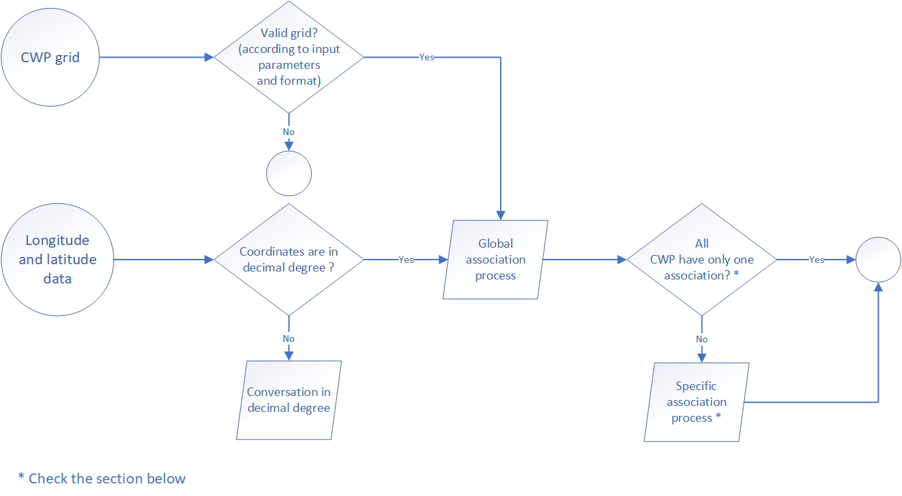

```{r, include = FALSE}
knitr::opts_chunk$set(
  collapse = TRUE,
  comment = "#>"
)
```

<div style="text-align: justify">

## Global aims

The function [latitude_longitude_cwp_manipulation](https://ob7-ird.github.io/furdeb/reference/latitude_longitude_cwp_manipulation.html) was developed for manage and manipulate spatial coordinates with integration of several data conversion process. You can choose between two processes (through the argument "manipulation_process").

* latitude_longitude_to_cwp: in that case you want to associate latitude and longitude data to a CWP.

* cwp_to_latitude_longitude: in that case you want to associate a CWP to combination of latitude and longitude. 

Globally, information and definition of CWP methodology and process was available on the [FAO website](https://www.fao.org/cwp-on-fishery-statistics/handbook/general-concepts/main-water-areas/en/#c737533). Furthermore, the function can manage and convert several kinds of data (for example conversion of latitude and longitude in degree/minute/seconde to decimal degree) and could use a different CWP scale grid. All the configuration process was explained below according to the two global processes cited above.

Regarding the CWP grids (provide to the function through the argument "referential_grid_file_path"), you can find them into the [FAO Map Catalog](https://data.apps.fao.org/map/catalog/srv/fre/catalog.search#/search?any=cwp). We recommend using a furdeb call [fao_cwp_shape_manipulation](https://ob7-ird.github.io/furdeb/reference/fao_cwp_shape_manipulation.html) the first time to optimise the shape file reading process on R and create for the second time a RData of the shape file.

## Latitude/longitude to CWP

The aim of this process if to associate latitude and longitude data to a CWP. The global process is describe in the figure below.



Some time, it happen that several CWP were associated to a single coordinate, for example when the position is located on the square grid line. When it appear, the function select the "best" CWP according to the following rules:

- if the squares are located in the same quadrant, the "best" CWP is the one closer to the position of latitude 0 and longitude 0. For the case of 4 squares concerned (the position associated is located on the square grid lines regarding latitude and longitude orientation) it's easy to understand the selection. In the case of only 2 squares concerned (the position associated is located on the horizontal or vertical-square grid lines), the "best" CWP is the one closer to the Greenwich meridian or the equator. 

- if the squares are located in several quadrant, the square associated with the first quadrant is the top priority, following by the second or the fourth.

## CWP to latitude/longitude

The aim of this process if to associate latitude and longitude data from a CWP. Just like before, the global process is describe in the figure below.


        
</div>
